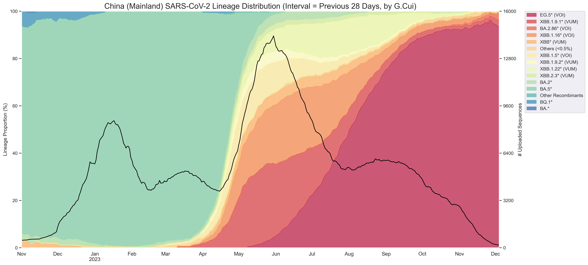

# SARS-CoV-2-Lineage-Distribution
 SARS-CoV-2 Lineage Distribution Analysis.

本项目是一个 SARS-CoV-2 各谱系占比随时间变化情况的分析工具。

This project is an analysis tool for tracking the proportion of various lineages of SARS-CoV-2 over time.

运行方式为命令式。

The execution method is command-based.

首先使用 `GET <区域名> [FROM <开始日期>] [TO <结束日期>] [INTERVAL <每次查询区间长度>]` 命令从中国国家生物信息中心 (CNCB) 的 API 获取数据；

First, use the command `GET <region_name> [FROM <start_date>] [TO <end_date>] [INTERVAL <query_interval_length>]` to retrieve data from the China National Center for Bioinformation (CNCB) API.

然后使用 `VISUALIZE [(谱系划分粒度) ALL | FINE | COARSE] [FROM <开始日期>] [TO <结束日期>] [INTERVAL <日期分桶区间长度>] [STEP <日期前进步长>]` 来可视化数据。

Then, use the command `VISUALIZE [(lineage_granularity) ALL | FINE | COARSE] [FROM <start_date>] [TO <end_date>] [INTERVAL <date_bucket_interval>] [STEP <date_advance_step>]` to visualize the data.

图片是中国大陆 2022-11-01 至 2023-12-04 SARS-CoV-2 各谱系占比随时间变化情况的可视化。

The visualization depicts the proportions of various lineages of SARS-CoV-2 in mainland China from November 1, 2022, to December 4, 2023, as they change over time.

